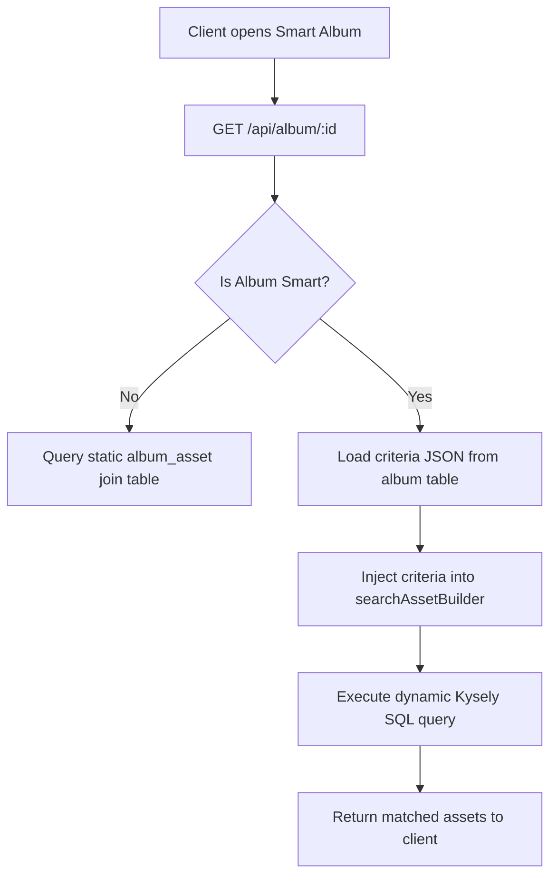

# Technical Design Document: Dynamic "Smart Albums" for Immich

This document outlines the architectural plan and technical specifications for implementing **Smart Albums** in the Immich application. A "Smart Album" is a dynamic, rule-based collection of assets that automatically updates whenever its criteria are met, rather than relying on a static, manual association.

---

## 🏗️ Architectural Overview

The core design philosophy is to keep smart albums **stateless and dynamic**. 

Instead of writing a background job that frequently writes new matches to a static join table (which creates heavy database write overhead and synchronization lag), a smart album is a **saved query**. When a user opens a smart album, the backend dynamically compiles the album's JSON rules into a SQL query using the existing `searchAssetBuilder` logic.



---

## 💾 Database Schema Changes

We will modify the existing `album` table in the PostgreSQL database using a TypeORM migration:

```sql
-- Migration to enable Smart Albums
ALTER TABLE "album" ADD COLUMN "isSmart" BOOLEAN DEFAULT FALSE NOT NULL;
ALTER TABLE "album" ADD COLUMN "criteria" JSONB DEFAULT NULL;
```

### Example Criteria JSON Schema (`album.criteria`)
The JSON structure will directly map to the backend `SmartSearchDto` or `MetadataSearchDto` properties:

```json
{
  "personQuery": {
    "includes": [
      {
        "personIds": ["270802d0-c774-4f0c-94cf-3da3b70b9911", "2dc7a1a0-b220-4846-b29d-64634d3a758c"],
        "minCount": 2
      }
    ],
    "excludes": ["uuid-charlie"]
  },
  "query": "at the beach",
  "city": "San Francisco",
  "isFavorite": true
}
```

---

## ⚙️ Backend Implementation Plan

### 1. DTO Validation
Update the album creation and update schemas to accept the new properties:

```typescript
// server/src/dtos/album.dto.ts
export class CreateAlbumDto {
  // ... existing fields
  isSmart?: boolean;
  criteria?: any; // Validated against SmartSearchSchema or MetadataSearchSchema
}
```

### 2. Repository Layer Updates (`album.repository.ts`)
In the album retrieval query builder, we modify the asset loader:

```typescript
// server/src/repositories/album.repository.ts
async getAssets(albumId: string, pagination: PaginationOptions) {
  const album = await this.db.selectFrom('album').selectAll().where('id', '=', albumId).executeTakeFirst();
  
  if (album?.isSmart && album.criteria) {
    // Dynamic rule execution!
    return searchAssetBuilder(this.db, {
      ...album.criteria,
      ...pagination,
    }).execute();
  }

  // Fallback to standard static join
  return this.db
    .selectFrom('album_asset')
    .innerJoin('asset', 'asset.id', 'album_asset.assetId')
    .where('album_asset.albumId', '=', albumId)
    .execute();
}
```

### 3. Service Layer Enhancements (`album.service.ts`)
* When an asset is deleted, standard albums must delete their mapping. Smart albums do not need this because deleted assets are automatically filtered out by `searchAssetBuilder`'s native visibility checks.
* When adding assets manually to a smart album, we return a validation error: *"Manual additions are not supported on dynamic rule-based albums."*

---

## 🎨 Web Frontend UI/UX Design

The Svelte client will integrate the feature seamlessly into the search interface:

### 1. "Save Search as Smart Album" Button
Inside [+page.svelte](file:///workspace/immich/web/src/routes/(user)/search/[[photos=photos]]/[[assetId=id]]/+page.svelte), if active search terms are present, we render a beautiful, premium glassmorphism action button:
* **Label**: `Save as Smart Album`
* **Action**: Opens a modal to name the album, then calls `POST /api/album` sending `{ name, isSmart: true, criteria: currentSearchTerms }`.

### 2. Smart Album Indicator Badge
Inside the Albums sidebar and album details view, we display a gorgeous dynamic gradient badge:
* `⚡ Smart Album` (signifying its automated, AI-driven nature).

---

## ✨ Key Benefits of this Architecture

1. **Zero Sync Lag**: When you upload new photos (e.g. at the beach, or featuring Katyn and Omar), they are instantly visible in the Smart Album the moment they are uploaded and analyzed.
2. **Zero Database Bloat**: No duplicate database rows are created in `album_asset` for newly matched items.
3. **Infinite Flexibility**: You can edit the smart album's criteria at any time (e.g. changing location from "San Francisco" to "All cities") without rebuilding any join tables.
